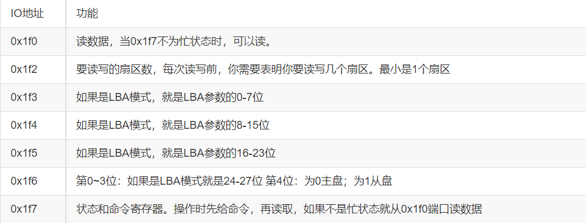

操作系统Lab1实验报告
=======================

-----

>专业：计算机科学与技术
>学号：2011188
>姓名：邵琦


<!-- @import "[TOC]" {cmd="toc" depthFrom=1 depthTo=6 orderedList=false} -->


# 一、练习1
## 1.1生成ucore.img
遇到的问题：在Makefile文件中可以找到生成ucore.img的相关代码，并且进行相关分析可以得出生成ucore.img的步骤，但对于Makefile的其他相关代码有不理解的地方。

解决：首先找到有关ucore.img的代码：

```
# create ucore.img
UCOREIMG	:= $(call totarget,ucore.img)  #totarget的作用是添加bin/前缀:UCOREIMG = bin/ucore.img

#(1)为UCOREIMG分配空间　512*10000
#(2)把bootblock中的内容写到第一个块
#(3)把kernel中的内容写到第二个块，从文件开头跳过seek个块

$(UCOREIMG): $(kernel) $(bootblock)  #生成依赖于kernel和bootblock 
	$(V)dd if=/dev/zero of=$@ count=10000
	$(V)dd if=$(bootblock) of=$@ conv=notrunc
	$(V)dd if=$(kernel) of=$@ seek=1 conv=notrunc

$(call create_target,ucore.img) #返回
```

不难发现，生成ucore.img需要kernel以及bootblock，则返回再找相关代码：

```
# create kernel target
kernel = $(call totarget,kernel)

$(kernel): tools/kernel.ld        //生成kernel目标文件需要依赖于kernel的链接配置文件以及tools

$(kernel): $(KOBJS)               //kernel的生成还依赖KOBJS
	@echo + ld $@                 //$@代表目标文件 将以下文件和目标文件链接起来
	$(V)$(LD) $(LDFLAGS) -T tools/kernel.ld -o $@ $(KOBJS)   //链接obj/libs/*和obj/kernel/init/*...所有的目标文件，使用kernel.ld做连接器脚本
	@$(OBJDUMP) -S $@ > $(call asmfile,kernel)   //最终的内核文件去除符号表等信息，并输出符号表信息，汇编文件信息，和输出信息
	@$(OBJDUMP) -t $@ | $(SED) '1,/SYMBOL TABLE/d; s/ .* / /; /^$$/d' > $(call symfile,kernel)

$(call create_target,kernel)
```

```
# create bootblock             //为了生成bootblock，首先应生成bootasm.o,bootmain.c和sign
bootfiles = $(call listf_cc,boot)      //用boot替换listf_cc里面的变量，将listf_cc的返回值赋给bootfiles
$(foreach f,$(bootfiles),$(call cc_compile,$(f),$(CC),$(CFLAGS) -Os -nostdinc))

bootblock = $(call totarget,bootblock) 

$(bootblock): $(call toobj,$(bootfiles)) | $(call totarget,sign)  //生成目标文件bootblock需要依赖于sign和bootfiles
	@echo + ld $@        //将以下文件与bootblock连接起来
	$(V)$(LD) $(LDFLAGS) -N -e start -Ttext 0x7C00 $^ -o $(call toobj,bootblock)
	@$(OBJDUMP) -S $(call objfile,bootblock) > $(call asmfile,bootblock)    //移除bootblock中所有的符号和重定位信息
	@$(OBJCOPY) -S -O binary $(call objfile,bootblock) $(call outfile,bootblock)
	@$(call totarget,sign) $(call outfile,bootblock) $(bootblock)

$(call create_target,bootblock)
```

## 1.2有关sign
遇到的问题：sign的作用是什么？

解决：起初以为sign也是主引导扇区的组成部分，所以分析代码的时候一直不理解它和主引导扇区功能是怎么对应的。后来发现，sign是将bootasm.s(实现保护模式转换)和bootmain.c(往内存读kernel)结合形成的bootblock.out转换成了一个512字节的符合主引导扇区要求的主引导扇区bootblock。也就是说，sign是一个包装的工具。


## 1.3硬盘主引导扇区
遇到的问题：硬盘主引导扇区与什么有关？

解决：通过代码，可知通过sign.c文件的操作使得bootblock.o成为一个符合规范的引导扇区，因此查看sign.c的内容（部分）：

```
char buf[512];
buf[510] = 0x55;
buf[511] = 0xAA;//// 把buf数组的最后两位置为 0x55, 0xAA
FILE *ofp = fopen(argv[2], "wb+");
size = fwrite(buf, 1, 512, ofp);
if (size != 512)//大小为512 {
    fprintf(stderr, "write '%s' error, size is %d.\n", argv[2], size);
    return -1;
}
```

# 二、练习2
无。


# 三、练习3
## 3.1 从bootloader进入保护模式的过程
遇到的问题：A20门是什么？感觉不是很了解。

解决：一开始8086的地址线有20位，也就是说具有0-1M的寻址范围，不过当时的寄存器只有16位，无法满足寻址需求，所以采用了另外一种寻址方式：一个16位寄存器表示基址*16+另外一个16位寄存器表示偏移地址，这样寻址空间就超过了1M。但到了后来，地址线增加到了32位，为了让以前的机器也能使用这种方式(即向下兼容)，就在A20(第20根地址线)上做了一个开关，当A20被使能时，是一根正常的地址线，但是当不被使能时永远为零。在保护模式下，要访问高端的内存必须要打开这个开关，否则第21位一定是0.

为何开启A20：通过概念，不难理解，一开始时A20地址线控制是被屏蔽的（总为0） ，直到系统软件通过一定的IO操作去打开它。很显然，在实模式下要访问高端内存区，这个开关必须打开，在保护模式下，由于使用32位地址线，如果A20恒等于0，那么系统只能访问奇数兆的内存，即只能访问0–1M、2-3M、4-5M…，这样无法有效访问所有可用内存。所以在保护模式下，这个开关也必须打开。

如何开启A20：通过阅读代码，可以找到开启A20代码如下：

```
seta20.1:            
    inb $0x64, %al   //读取当前状态到al寄存器           
    testb $0x2, %al  //#检查当前状态寄存器的第二位是否为1(缓冲区是否为空)
    jnz seta20.1     //#若缓冲区不为0，跳转到开始处

    movb $0xd1, %al  //将0xd1写入al中                         
    outb %al, $0x64  //#向0x64h发送0xd1h命令，表示要写                     

seta20.2:            
    inb $0x64, %al          
    testb $0x2, %al  
    jnz seta20.2     

    movb $0xdf, %al  //将0xdf入al中                         
    outb %al, $0x60  //将0xdf入到0x60端口中，打开A20           
```

# 四、练习4

## 4.1读取硬盘扇区
遇到的问题：材料提供了读一个扇区的大致流程，但与代码结合分析时，不理解具体步骤。

解决：首先是大致流程：

1.等待磁盘准备好

2.发出读取扇区的命令

3.等待磁盘准备好

4.把磁盘扇区数据读到指定内存



再与bootmain.c相关代码结合：
```
/* waitdisk - wait for disk ready */
static void
waitdisk(void) {
    while ((inb(0x1F7) & 0xC0) != 0x40)//如果0x1F7的最高2位是01，跳出循环
        /* do nothing */;
}

/* readsect - read a single sector at @secno into @dst */
static void
readsect(void *dst, uint32_t secno) {
    // wait for disk to be ready
    waitdisk();

    outb(0x1F2, 1);                         // count = 1 读取一个扇区
    outb(0x1F3, secno & 0xFF);  //要读取的扇区编号
    outb(0x1F4, (secno >> 8) & 0xFF);  //用来存放读写柱面的低8位字节 
    outb(0x1F5, (secno >> 16) & 0xFF);  //用来存放读写柱面的高2位字节
    outb(0x1F6, ((secno >> 24) & 0xF) | 0xE0);  //用来存放要读/写的磁盘号及磁头号
    outb(0x1F7, 0x20);                      // cmd 0x20 - read sectors

    // wait for disk to be ready
    waitdisk();

    // read a sector
    insl(0x1F0, dst, SECTSIZE / 4);//获取数据
}
```

之后，readseg简单包装了readsect，可以从设备读取任意长度的内容。

```
static void
    readseg(uintptr_t va, uint32_t count, uint32_t offset) {
        uintptr_t end_va = va + count;

        va -= offset % SECTSIZE;
        //因为readseg每次读入的都是扇区大小的整数倍，读进内存以后va和实际要读的区域入口有一段距离，用va减去这个空出的值得到va'，这时读入的扇区放到va'开始的地方，则正好使要读入的地方和原来的va对齐。

        uint32_t secno = (offset / SECTSIZE) + 1; 
        // 加1因为0扇区被引导占用
        // ELF文件从1扇区开始

        for (; va < end_va; va += SECTSIZE, secno ++) {
            readsect((void *)va, secno);
        }
    }
```

可以得出具体步骤：

1.等待硬盘空闲。waitdisk的函数实现只有一行：while ((inb(0x1F7) & 0xC0) != 0x40)，意思是不断查询读0x1F7寄存器的最高两位，直到最高位为0、次高位为1（这个状态应该意味着磁盘空闲）才返回。

2.硬盘空闲后，发出读取扇区的命令。对应的命令字为0x20，放在0x1F7寄存器中；读取的扇区数为1，放在0x1F2寄存器中；读取的扇区起始编号共28位，分成4部分依次放在0x1F3~0x1F6寄存器中。

3.发出命令后，再次等待硬盘空闲。

4.硬盘再次空闲后，开始从0x1F0寄存器中读数据。注意insl的作用是从I/O端口port读取count个数据(单位双字)到以内存地址addr为开始的内存空间，是以dword即4字节为单位的，因此这里SECTIZE需要除以4.

# 五、练习5

## 5.1函数print_stackframe的实现
遇到的问题：read_ebp()、read_eip()两个函数感觉不是很能理解。

解决：通过代码研究分析，发现read_ebp定义为inline函数，而read_eip为常规函数。

原因是：调用read_ebp函数来获取执行print_stackframe函数时ebp寄存器的值，这里read_ebp必须定义为inline函数，否则获取的是执行read_ebp函数时的ebp寄存器的值。
调用read_eip函数来获取当前指令的位置，也就是此时eip寄存器的值。这里read_eip必须定义为常规函数而不是inline函数，因为这样的话在调用read_eip时会把当前指令的下一条指令的地址（也就是eip寄存器的值）压栈，那么在进入read_eip函数内部后便可以从栈中获取到调用前eip寄存器的值。

## 5.2解释最后一行各个参数的含义
遇到的问题：最后一行是ebp:0x00007bf8 eip:0x00007d6e args:0xc031fcfa 0xc08ed88e 0x64e4d08e 0xfa7502a8，共有ebp，eip和args三类参数，感觉不是很理解。

解决：

ebp:0x0007bf8：

此时ebp的值是kern_init函数的栈顶地址，从obj/bootblock.asm文件中知道整个栈的栈顶地址为0x00007c00，ebp指向的栈位置存放调用者的ebp寄存器的值，ebp+4指向的栈位置存放返回地址的值，这意味着kern_init函数的调用者（也就是bootmain函数）没有传递任何输入参数给它，因为单是存放旧的ebp、返回地址已经占用8字节了。在bootasm在call bootmain之后，会从7c00开始，把返回地址和原本的ebp压栈，使得现在的ebp变成了7c00-8-8=7bf8。

eip:0x00007d72：

eip的值是从bootasm.s跳转到bootmain前的地址，也就是bootmain的返回地址。

args:0xc031fcfa 0xc08ed88e 0x64e4d08e 0xfa7502a8

通常状态下，args存放的四个dword是对应4个输入参数的值。但是在最底层处，即7c00往后增加的地址处，那里是bootloader的代码段，所以最后的args其实是bootloader指令的前十六个字节。

整个查看堆栈的结果的逻辑：

运行kdebug.c中的print_stackframe的函数后，函数会在0-7c00的栈中，从低位向高位扫描，读出其中的ebp和eip。越先打印出来的，就是约在栈顶的ebp，也就是越后执行的函数。从打印出来的信息可以看出函数的调用顺序是：bootasm.s -> bootmain (->) kern_init ->grade_backtrace ->grade_backtrace1 -> grade_backtrace2 -> mon_backtrace -> print_stackframe

# 六、实验6

## 6.1中断描述符表

遇到的问题：中断描述符表（也可简称为保护模式下的中断向量表）中一个表项占多少字节？其中哪几位代表中断处理代码的入口？

解决：保护模式下，段寄存器含有段选择子；CPU收到中断信息后，需要先根据中断类型码找到对应的中断处理程序地址，这个过程通过查中断描述符表（获得特定中断处理程序的偏移量并以中断向量为索引查找中断处理程序的段选择子）以及全局描述符表（通过中断处理程序的段选择子获得段基址）完成；一个表项被称作一个门描述符，占八个字节。三种类型（还有第四种：调用门描述符，结构与任务门描述符相同）的门描述符结构。

一个表项的结构如下：

```
/* Gate descriptors for interrupts and traps */
struct gatedesc {
    unsigned gd_off_15_0 : 16;        // low 16 bits of offset in segment
    unsigned gd_ss : 16;            // segment selector
    unsigned gd_args : 5;            // # args, 0 for interrupt/trap gates
    unsigned gd_rsv1 : 3;            // reserved(should be zero I guess)
    unsigned gd_type : 4;            // type(STS_{TG,IG32,TG32})
    unsigned gd_s : 1;                // must be 0 (system)
    unsigned gd_dpl : 2;            // descriptor(meaning new) privilege level
    unsigned gd_p : 1;                // Present
    unsigned gd_off_31_16 : 16;        // high bits of offset in segment
};
```

则中断描述符表一个表项占8个字节，其结构如下：
bit 63…48: offset 31…16

bit 47…32: 属性信息，包括DPL、P flag等

bit 31…16: Segment selector

bit 15…0: offset 15…0

其中第16 ~ 32位是段选择子，用于索引全局描述符表GDT来获取中断处理代码对应的段地址，再加上第0 ~ 15、48 ~ 63位构成的偏移地址，即可得到中断处理代码的入口。
